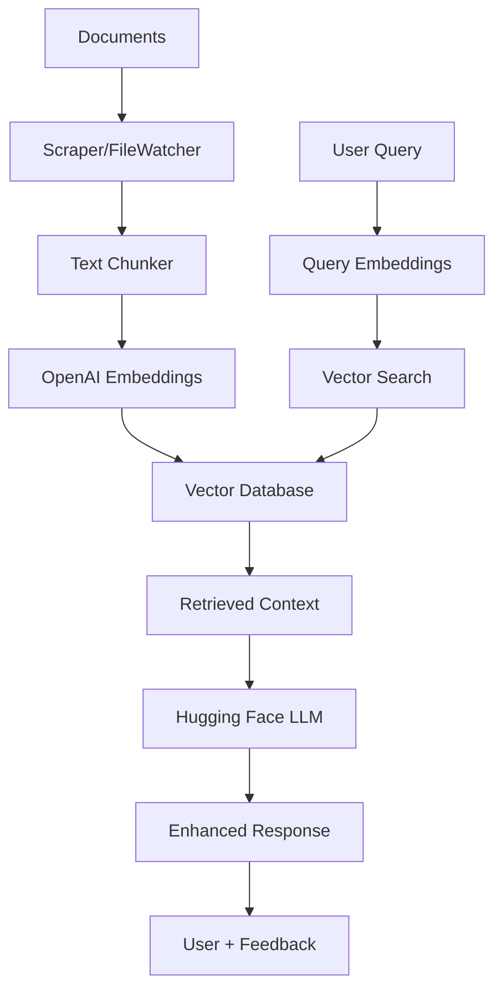

# RAG Pipeline for CampusCrew Chatbot

A production-ready Retrieval-Augmented Generation (RAG) pipeline that enhances the MERN chatbot with intelligent document retrieval and context-aware responses.

## 🚀 Quick Start

### Prerequisites

- Node.js 16+ and npm
- MongoDB (local or cloud)
- Vector Database (Qdrant or Pinecone)
- OpenAI API key for embeddings
- Hugging Face API key for LLM

### Installation

1. **Install Dependencies**
   ```bash
   cd backend
   npm install axios cheerio chokidar qdrant-js pinecone openai dotenv
   ```

2. **Environment Setup**
   ```bash
   # Copy and configure environment variables
   cp .env.example .env
   ```

   Required variables in `.env`:
   ```env
   # Vector Database (choose one)
   QDRANT_URL=http://localhost:6333
   QDRANT_API_KEY=your_qdrant_key
   PINECONE_API_KEY=your_pinecone_key
   PINECONE_INDEX_NAME=campuscrew-docs
   
   # OpenAI for embeddings
   OPENAI_API_KEY=your_openai_key
   
   # Hugging Face for LLM
   HF_TOKEN=your_hf_token
   HF_MODEL=HuggingFaceTB/SmolLM3-3B:hf-inference
   
   # MongoDB
   MONGODB_URI=mongodb://localhost:27017/campuscrew
   
   # RAG Configuration
   RAG_ENABLED=true
   VECTOR_DB_TYPE=qdrant
   EMBEDDING_DIMENSION=1536
   RETRIEVAL_TOP_K=5
   ```

3. **Vector Database Setup**

   **Option A: Qdrant (Recommended)**
   ```bash
   # Using Docker
   docker run -p 6333:6333 qdrant/qdrant
   
   # Or download locally from https://qdrant.tech/
   ```

   **Option B: Pinecone**
   - Sign up at https://pinecone.io/
   - Create an index with dimension 1536
   - Add API key to `.env`

4. **Create Knowledge Base**
   ```bash
   # Create directories for your documents
   mkdir -p backend/data/docs
   mkdir -p backend/data/scraped
   
   # Add your documents to backend/data/docs/
   # Supported formats: .txt, .md, .json, .html
   ```

5. **Initial Data Ingestion**
   ```bash
   node backend/src/workers/ingestWorker.js
   ```

## 📖 Usage

### Basic RAG Query

```javascript
const express = require('express');
const askRoute = require('./src/routes/ask');

const app = express();
app.use('/api/rag', askRoute);

// Query: POST /api/rag/ask
// Body: { "question": "How do I create an event?" }
```

### Integration with Existing Chatbot

Update your existing `ChatRoute.js`:

```javascript
const askRoute = require('../src/routes/ask');

// In your chat endpoint
app.post('/chat', async (req, res) => {
  const { message } = req.body;
  
  // Try RAG first for enhanced responses
  try {
    const ragResponse = await askRoute.processQuestion(message);
    if (ragResponse.confident) {
      return res.json({
        response: ragResponse.answer,
        source: 'rag',
        confidence: ragResponse.confidence
      });
    }
  } catch (error) {
    console.log('RAG failed, falling back to original logic');
  }
  
  // Fall back to your existing chat logic
  // ... your current implementation
});
```

### File Watching (Auto-Updates)

```javascript
const FileWatcher = require('./src/tasks/watcher');

const watcher = new FileWatcher({
  directories: ['./data/docs', './data/website_content'],
  debounceDelay: 2000
});

await watcher.start();
console.log('📁 File watcher started - documents will auto-update');
```

## 🏗️ Architecture

### Core Components

```
backend/src/
├── config.js              # Centralized configuration
├── routes/
│   ├── ask.js             # RAG query endpoint
│   └── feedback.js        # User feedback collection
├── utils/
│   ├── scraper.js         # Web content extraction
│   └── chunker.js         # Text chunking for embeddings
├── workers/
│   └── ingestWorker.js    # Document processing pipeline
└── tasks/
    └── watcher.js         # File system monitoring
```

### Data Flow



## 🔧 Configuration

### Vector Database

**Qdrant (Local)**
```javascript
const config = {
  VECTOR_DB_TYPE: 'qdrant',
  QDRANT_URL: 'http://localhost:6333',
  COLLECTION_NAME: 'campuscrew_docs'
};
```

**Pinecone (Cloud)**
```javascript
const config = {
  VECTOR_DB_TYPE: 'pinecone',
  PINECONE_API_KEY: 'your_key',
  PINECONE_INDEX_NAME: 'campuscrew-docs'
};
```

### Text Chunking

```javascript
const chunker = new TextChunker({
  chunkSize: 1000,        // Characters per chunk
  overlap: 200,           // Overlap between chunks
  preserveParagraphs: true,
  minChunkSize: 100
});
```

### Retrieval Settings

```javascript
const retrievalConfig = {
  topK: 5,                // Number of chunks to retrieve
  scoreThreshold: 0.7,    // Minimum similarity score
  maxContextLength: 4000, // Max characters in context
  diversityBoost: true    // Promote diverse results
};
```

## 🔍 Monitoring & Analytics

### Query Feedback

Track response quality:
```bash
# Positive feedback
POST /api/rag/feedback
{
  "queryId": "uuid",
  "rating": 5,
  "comment": "Very helpful!"
}

# Negative feedback  
POST /api/rag/feedback
{
  "queryId": "uuid", 
  "rating": 1,
  "comment": "Not relevant"
}
```

### Analytics Dashboard

```javascript
// Get feedback analytics
GET /api/rag/feedback/analytics
{
  "averageRating": 4.2,
  "totalQueries": 150,
  "commonQueries": ["event creation", "registration"],
  "improvementAreas": ["contact information"]
}
```

## 🔧 Troubleshooting

### Common Issues

**1. Vector Database Connection**
```bash
# Check Qdrant status
curl http://localhost:6333/health

# Check collections
curl http://localhost:6333/collections
```

**2. Embedding Failures**
```bash
# Test OpenAI API
curl -H "Authorization: Bearer $OPENAI_API_KEY" \
     -H "Content-Type: application/json" \
     -d '{"input":"test","model":"text-embedding-ada-002"}' \
     https://api.openai.com/v1/embeddings
```

**3. No Search Results**
- Check if documents are properly ingested
- Verify embedding dimensions match
- Lower similarity threshold in config

**4. Poor Response Quality**
- Add more relevant documents
- Improve document chunking strategy
- Adjust retrieval parameters
- Collect user feedback for training

### Debug Mode

Enable detailed logging:
```bash
NODE_ENV=development npm start
# or
DEBUG=rag:* npm start
```

## 📈 Performance Optimization

### Caching Strategy

```javascript
// Redis caching for frequent queries
const redis = require('redis');
const client = redis.createClient();

// Cache embeddings and results
app.use('/api/rag', cacheMiddleware({
  ttl: 3600,  // 1 hour
  keyGenerator: (req) => `rag:${hash(req.body.question)}`
}));
```

### Batch Processing

```javascript
// Process multiple documents efficiently
const ingestWorker = new IngestWorker();
await ingestWorker.ingestDocuments({
  files: ['doc1.txt', 'doc2.md'],
  urls: ['https://example.com/faq'],
  batchSize: 10
});
```

## 🚀 Production Deployment

### Docker Setup

```dockerfile
# Dockerfile for RAG service
FROM node:18-alpine
WORKDIR /app
COPY package*.json ./
RUN npm ci --only=production
COPY . .
EXPOSE 3000
CMD ["node", "src/workers/ingestWorker.js"]
```

### Environment Variables

```bash
# Production .env
RAG_ENABLED=true
VECTOR_DB_TYPE=pinecone
LOG_LEVEL=info
CACHE_TTL=3600
MAX_QUERY_LENGTH=1000
RATE_LIMIT=100
```

### Health Checks

```javascript
// Health endpoint
app.get('/health/rag', async (req, res) => {
  const health = {
    vectorDb: await checkVectorDbHealth(),
    embeddings: await checkEmbeddingsHealth(),
    ingestWorker: await checkIngestWorkerHealth()
  };
  
  const isHealthy = Object.values(health).every(Boolean);
  res.status(isHealthy ? 200 : 503).json(health);
});
```

## 📝 API Reference

### Ask Endpoint

**POST** `/api/rag/ask`

Request:
```json
{
  "question": "How do I create an event?",
  "userId": "user123",
  "sessionId": "session456"
}
```

Response:
```json
{
  "queryId": "uuid",
  "answer": "To create an event...",
  "confidence": 0.85,
  "sources": [
    {
      "document": "event_guide.md",
      "chunk": "Creating events is simple...",
      "score": 0.92
    }
  ],
  "responseTime": 850
}
```

### Feedback Endpoint

**POST** `/api/rag/feedback`

Request:
```json
{
  "queryId": "uuid",
  "rating": 4,
  "comment": "Helpful but could be more detailed",
  "userId": "user123"
}
```

### Ingest Endpoint

**POST** `/api/rag/ingest`

Request:
```json
{
  "sources": {
    "files": ["./docs/new_guide.md"],
    "urls": ["https://example.com/help"]
  }
}
```

## 🤝 Contributing

1. Add new document types in `chunker.js`
2. Implement new vector databases in config
3. Enhance scraping capabilities in `scraper.js`
4. Improve response ranking algorithms
5. Add multilingual support

## 📄 License

MIT License - see LICENSE file for details.

---

For support or questions, check the [Issues](https://github.com/your-repo/issues) section or contact the development team.